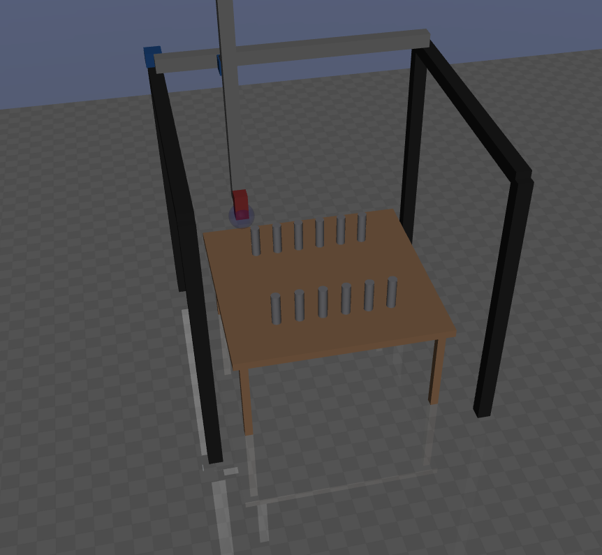

## Overview

This repository contains **Assignment 1** of the 2025/2026 _Laboratorio di Automatica_ course at the [_Università degli Studi di Brescia_](https://www.unibs.it/it). The authors decline any responsibility for usage outside this scope. The provided tools support the development, simulation, and implementation of control systems for mechatronic applications. Developed by [CARI JRL](https://cari.unibs.it/).

> You need to install [labauto_control_library](https://github.com/JRL-CARI-CNR-UNIBS/labauto_control_library/tree/master) and activate the Conda environment before using this repository.

## Assignment goal

The goal of this assignment is to design and tune a control algorithm for a **gantry crane** so that it can execute a given trajectory **as fast as possible** while **avoiding collisions** with the cylinders placed on the robot working table.

The assignment combines:

- controller tuning
- identification experiments
- frequency-response validation
- trajectory execution in simulation

Students are expected to work mainly on the controller configuration files and use the provided scripts to identify, validate, and test their solutions.



## Repository structure

```text
.
├── gantry_portal_sea_soft
│   ├── control_config.yaml
│   ├── initial_control_config.yaml
│   ├── model.urdf
│   ├── model_without_vases.xml
│   ├── model.xml
│   ├── params.yaml
│   ├── README.md
│   ├── rigid_model.xml
│   ├── tests
│   │   └── trajectory_20260306173155.mat
│   ├── trajectory.gcode
│   └── trajectory.txt
├── identification_experiment.py
├── README.md
├── robot_simulation.py
├── validation_experiments.py
└── validation_experiments_working_points.py
```

## Main scripts

The repository provides four main Python scripts.

### `robot_simulation.py`

Runs the robot simulation and executes the assigned trajectory.

Use this script to test the complete behavior of your controller on the target motion task, including the interaction with the working table and the cylinders.

### `identification_experiment.py`

Runs a chirp-based identification experiment without the table and without the cylinders, then stores the results in the `tests/` subfolder.

Use this script to obtain experimental data for controller design and model validation.

### `validation_experiments.py`

Runs several chirp tests to validate the frequency response function (FRF) in a single working point.

Use this script to verify whether the identified dynamics and the designed controller are consistent around one operating condition.

### `validation_experiments_working_points.py`

Runs several chirp tests to validate the FRF at different working points.

Use this script to study how the system dynamics vary across the workspace.

## Configuration files

The main files students are expected to modify are located in the robot folder.

### `gantry_portal_sea_soft/control_config.yaml`

Contains the controller parameters to be tuned.

This is the main file you will modify during the assignment.

### `gantry_portal_sea_soft/initial_control_config.yaml`

Contains the initial controller parameters used for identification and validation experiments.

This file is typically used as the baseline configuration.

### `gantry_portal_sea_soft/trajectory.txt`

Contains the trajectory to be executed by the simulated robot.

This file defines the motion task used for the final test.

## Other files

All the other files in the repository are related to the simulation setup and generally do not require any intervention.

In particular, model files such as:

- `model.xml`
- `model_without_vases.xml`
- `rigid_model.xml`
- `model.urdf`
- `params.yaml`

are provided as part of the simulation environment and should normally be left unchanged.

## Suggested workflow

A typical workflow for the assignment is:

1. Install `labauto_control_library` and activate the correct Conda environment.
2. Run `identification_experiment.py` to collect identification data.
3. Run `validation_experiments.py` and `validation_experiments_working_points.py` to study the system FRF.
4. Tune the controller in `control_config.yaml` and set the maximum allowed velocities and accelerations.
5. Run `robot_simulation.py` to test the trajectory execution.
6. Iterate until the robot completes the task quickly and without hitting the cylinders.

## Installation

This repository depends on `labauto_control_library`.

Follow the installation instructions in the main library repository:

- [labauto_control_library](https://github.com/JRL-CARI-CNR-UNIBS/labauto_control_library/tree/master)

In summary:

1. Create and activate the Conda environment required by `labauto_control_library`.
2. Install all its dependencies.
3. Install or update the library from the GitHub repository.
4. Run the scripts in this repository from that active environment.

## Running the scripts

After activating the Conda environment, you can launch the scripts from the repository root.

### Run the simulation

```bash
python robot_simulation.py
```

### Run the identification experiment

```bash
python identification_experiment.py
```

### Run the validation experiments in one working point

```bash
python validation_experiments.py
```

### Run the validation experiments in multiple working points

```bash
python validation_experiments_working_points.py
```

> On macOS, if MuJoCo is required by your environment, use `mjpython` instead of `python`.

## Expected student activity

For this assignment, students are mainly expected to:

- understand the crane dynamics through identification and validation experiments
- tune the controller parameters
- evaluate performance in simulation
- improve execution speed while keeping the motion safe
- avoid collisions with the cylinders on the working table

## Output data

Experimental and simulation results are stored in the `tests/` subfolder inside the robot directory whenever applicable.

These results can be used for analysis, comparison, and reporting.

## Notes

- Use a clean Conda environment.
- Do not source ROS in the same terminal when using the Conda environment, since dependency clashes may occur.
- Do not modify the simulation model files.
- Focus your work on the controller configuration and on the analysis of the generated test data.

## Course context

This repository is intended for educational use within the _Laboratorio di Automatica_ course.

The proposed setup allows students to work on a realistic control-design problem involving:

- dynamic identification
- validation in the frequency domain
- motion control
- performance/safety trade-offs in a constrained environment
